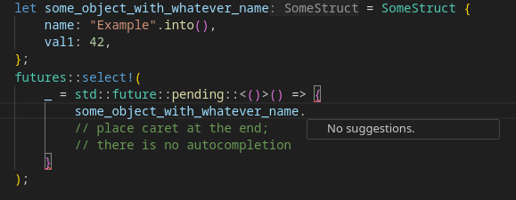
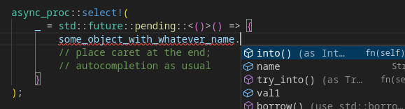

# futures::select!() with rust-analyzer autocompletion

This is a thin wrapper over futures::select!() that works exactly the
same, but also offers autocompletion in any IDE that uses rust-analyzer.




See for yourself in [example/main.rs](./example/main.rs)

# How it works

The macro doesn't parse the input, only transforms the raw TokenStream-s,
only splitting it on tokens like `=>` or `{`. The input code is effectively
copy/pasted, and this macro doesn't care if it's valid syntax. If it's
invalid, the macro will output the same invalid code, letting the rust-analyzer
do its magic.

The original futures::select! macro tries to parse its input into `syn::Block`
and `syn::Expr`, but those can only represent valid Rust syntax. If the
parsing fails, the macro doesn't output any code (only an error or a panic)
and rust-analyzer has no code to work with, giving you no code completions
whatsoever.

# How to use

In your vscode settings.json add:
```
    "rust-analyzer.cargo.extraEnv": {
        "IS_RUST_ANALYZER": "1"
    }
```
